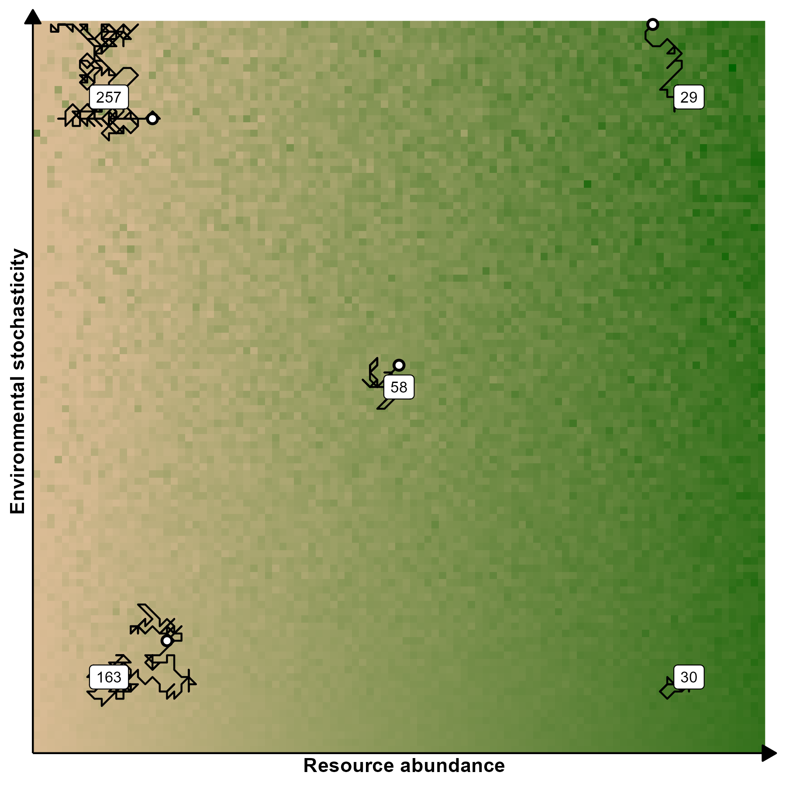

\newpage

# Chapter 3: Movement analyses {#movement}

This chapter will contain the analyses of the animal movement dataset which is central to this thesis, including how the animals' spatial needs and behaviors were quantified. It will then use the results and products from the previous chapters (namely the movement simulations and the raster of environmental variance) to estimate the effects of resource abundance and environmental variance on animals' spatial needs. Animal movement data will be modeled using continuous-time (stochastic) movement models (CTMMs), which assume movement data to being generated from stochastic process with spatiotemporal autocorrelation. In contrast, most models used in movement ecology [e.g., minimum convex polygon, @mohr_table_1947; kernel density estimation, @worton_kernel_1989; k-local convex hull, @getz_local_2004] assume movement processes to be temporally discrete (e.g., an animal moves at the same time every day) and spatiotemporally independent (i.e., the current position of an animal now does not affect where it will be). The assumption of temporally discrete observations can be satisfied easily with a consistent data collection procedure (or data thinning), while the assumption of spatiotemporal independence may hold if the time between observations is particularly long (relative to the animal's $\tau_p$). However, it is not hard to demonstrate that animal movement is not a discrete process, nor is it spatiotemporally independent: The position an animal is in at any given moment depends on where it was before, and it will affect where it will be later. Thus, when observations are taken with sufficient frequency, neither assumption is valid.

While the assumptions of discrete and independent observations may be acceptable (and even necessary) for small datasets which do not contain sufficient information to estimate autocorrelation structures [@de_solla_eliminating_1999; @blundell_linear_2001; @fieberg_kernel_2007], they are not appropriate for any high-frequency dataset, since such data is likely autocorrelated [@noonan_comprehensive_2019]. This is particularly the case with high-frequency data, since modern animal tracking datasets often have a lag-1 autocorrelation $\approx 1$ (i.e., two consecutive observations are almost identical). In such cases, the sample size (i.e., the number of observations, often indicated as $n$) of a dataset is not representative of the amount of information the dataset includes, so the concept of an *effective* sample size is preferred (indicated here as $n_{eff}$). The effective sample size indicates the estimated number of independent observations, so it decreases as autocorrelation increases. When autocorrelation is not accounted for and the data is highly autocorrelated (which implies $n_{eff}$ is much smaller that $n$), any estimated measure of uncertainty is underestimated, so home range estimates tend to be artificially small [@noonan_comprehensive_2019].

However, high autocorrelation is not an issue, as long as it is accounted for. Instead, it provides a more realistic representation of animal movement. Coarsening data until sampling occurs to regular intervals so autocorrelation is (arbitrarily) statistically not significant removes important properties of the dataset and nullifies great part of the benefits achieved with recent improvements in tracking technologies. Thus, it is increasingly important to model animal movement data using models that (1) do not assume data is regularly sampled, and (2) account for the spatiotemporal autocorrelation within the data.

Continuous-time (stochastic) movement models (CTMMs) such as Ornstein-Uhlenbeck (OU) and OU foraging (OUF) models relax the assumption of spatiotemporal independence by accounting for positional autocorrelation (OU and OUF models) and directional (i.e., velocity) autocorrelation (OUF models only). This allows the models to estimate the animal's average home range crossing time (OU and OUF) and the animal's average directional persistence (OUF only). @peron_periodic_2017 provide additional information OU and OUF models and how to interpret them while also demonstrating how to use high-frequency movement data can help detect small-scale cycles, such as patterns that occur daily or weekly.

In this thesis, each animal's movement will be modeled using individual CTMMs, while the effects of resource abundance and environmental variance on various movement parameters (HR size, average speed, $\tau_p$, $\tau_v$) will be estimated using Hierarchical Generalized Additive Models [HGAMs, see @pedersen_hierarchical_2019]. While it would be ideal to fit all movement data with a single hierarchical CTMM to use a single likelihood distribution and estimate common trends between animals and variances between animals' movement parameters, the `ctmm` package does not currently support hierarchical models. However, uncertainty uncertainty in parameter estimates can still be accounted for in the HGAM by using some function of the parameters' standard error or $n_{eff}$ as a weight (such that estimates with less certainty or independent data have less importance).

```{r stoch-example-figure, fig.align='center', echo=FALSE, fig.cap = "Simulations depicting the effects of resource availability and stochasticity on spatial needs. Animals moved from the circles to nearby tiles until satiated. The labels indicate how many steps animals took to reach satiety. Note the higher spatial needs of animals in more unpredictable or resource-scarce environments. Resources were generated using a gamma random variable parameterized by independent mean and variance paramters, which represented the resource abundance and environmental stochasticity, respectively, even though the two are likely correlated in nature.", out.width = '0.5\\textwidth', fig.align = 'right', wrapfigure = list('R', 0.5)}

```

I expect home range size to decrease with resource abundance and increase with environmental variance, although environmental variance may have the most effect when $R$ is low and a much lower effect when $R$ is high (figure \@ref(fig:stoch-example-figure). Thus, the HGAM will include (1) a smooth predictor for resource abundance, (2) a smooth predictor of environmental variance, and (3) an smooth interaction effect of the two. The smooth interaction effect will allow the effect of environmental variance to depend on resource abundance (and vice-versa). Additionally, I plan to account for common trends between taxonomic groups by allowing each smooth effect to vary between taxonomic groups, but with a common degree of smoothness between groups [@pedersen_hierarchical_2019]. If there is no evidence of bias arising from the opportunistic sampling of the dataset, I may also include spatiotemporal smooth terms to allow the effects of resource abundance and environmental variance to change over time and space. However, it may be more appropriate to fit such a model to a subset of the data to minimize sampling bias.
