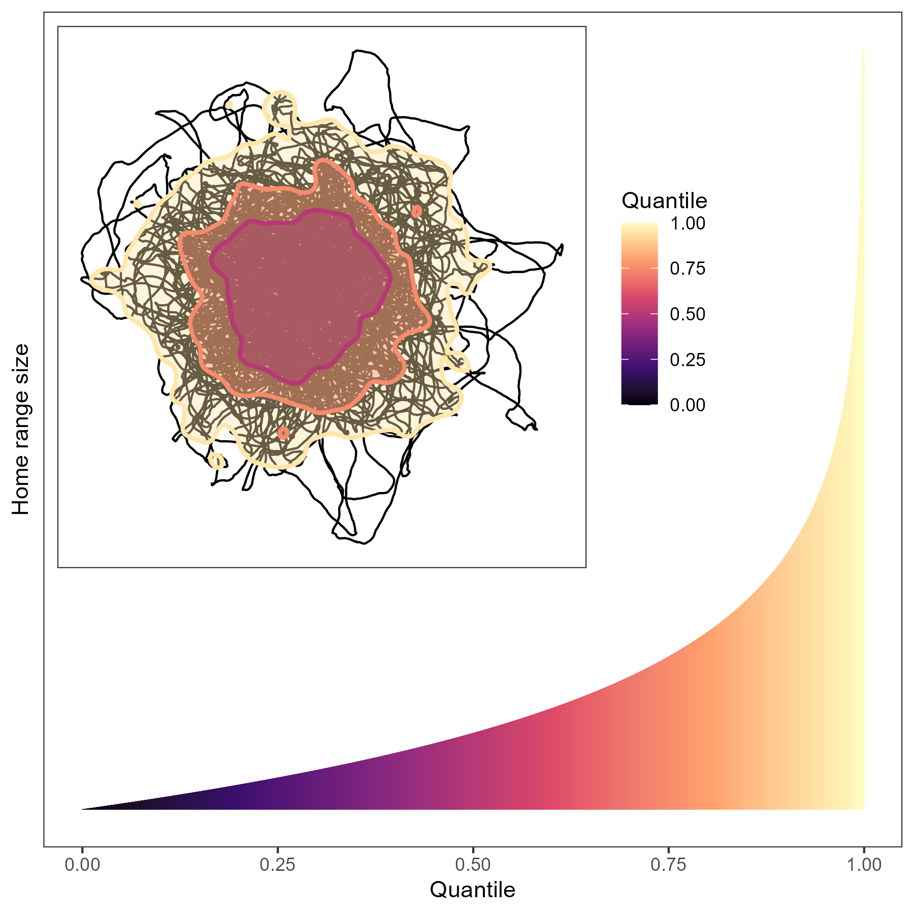
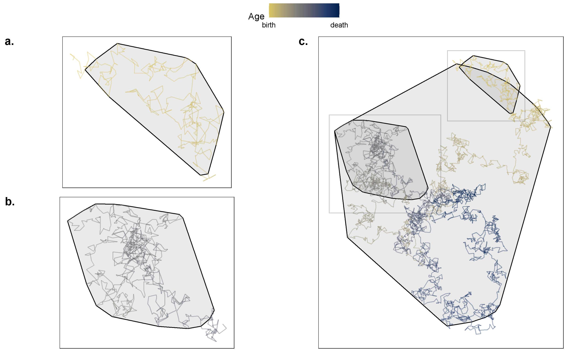
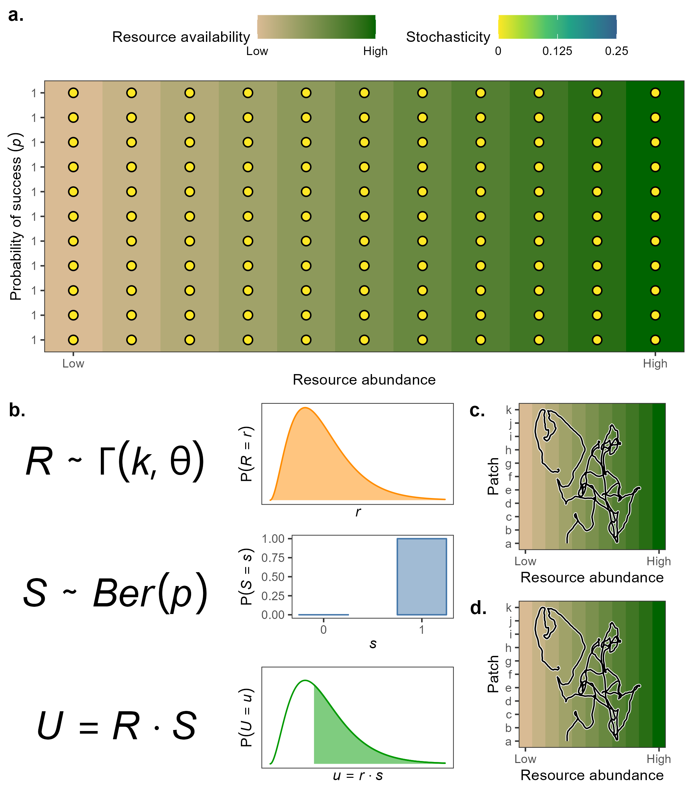
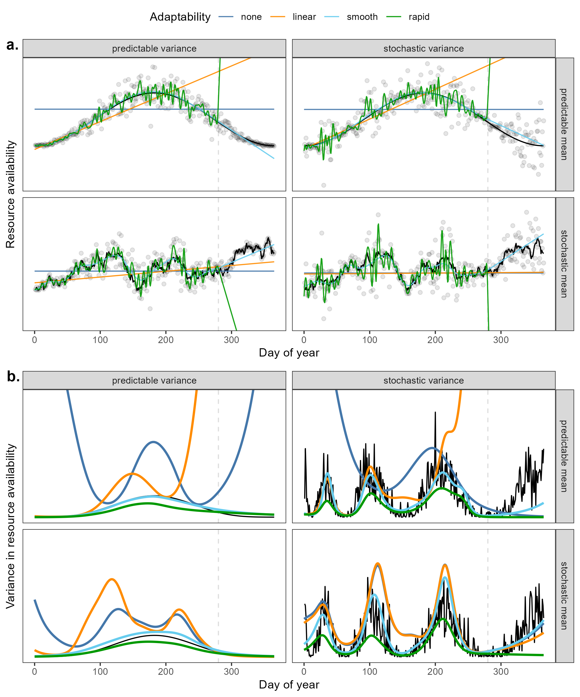
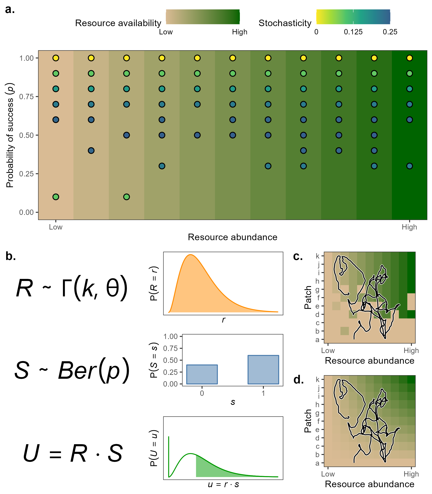
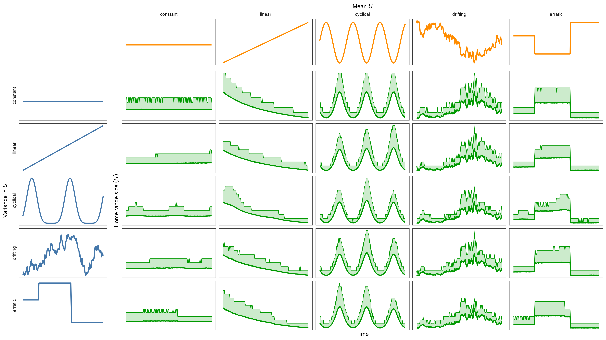
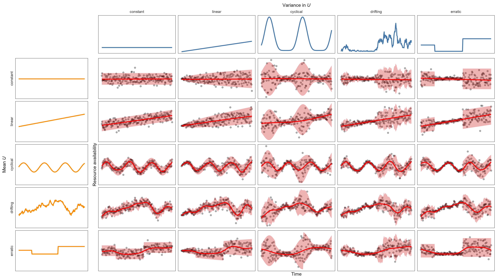
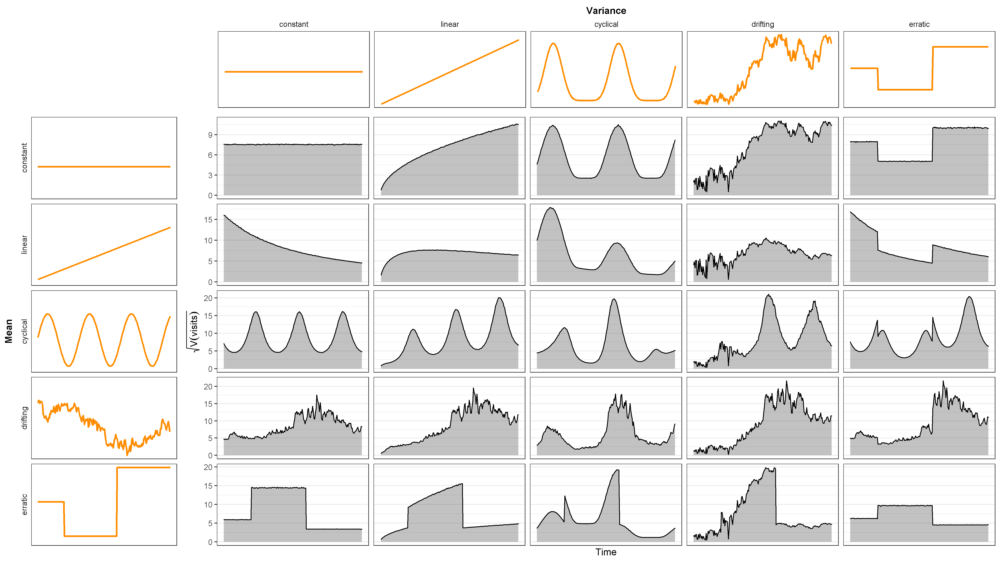

\newpage

# Chapter 1: Literature review and quantitative predictions

<!-- (Read http://www.zo.utexas.edu/courses/bio373/chapters/Chapter5/Chapter5.html) -->

## Home ranges as proxies for animals' needs

The ability to move provides animals with the capacity to respond rapidly and continuously to heterogeneous and changing environments. Animals may move to search for resources (e.g., as food, nutrients, water, heat, a new den or nesting spot), a mate, or a new group. Movement also allows animals to escape predation or dangerous competition, and it allows them to defend resources and territory, too. Thus, we can estimate changes in animals' movement and space use as a proxy for many needs, rather than measuring changes in the various individual needs [@nathan_movement_2008].

<!-- place figures before the paragraph they are referred to so wrapfigure places them beside the paragraph -->

```{r hr-quantiles, fig.cap="Inset: Simulated movement of an animal with a stationary home range centroid. The colored areas indicate the home range estimates for different quantiles. The red area indicates the core home range (50\\%), while the blue and green areas indicate the 75\\% and 95\\% home ranges, respectively. Main figure: Home range area as a function of utilization quantile. Note that as the quantile approaches 1, home range size approaches infinity, since if the animal was to move for an infinite amount of time, it would cover all possible space.", out.width = '0.4\\textwidth', fig.align = 'right', wrapfigure = list('R', 0.4)}

```

In this context, the concept of a home range (HR) has a long history in ecological research as an indicator of the space an animal requires to satisfy its essential requirements during a period of time [@burt_territoriality_1943, see figure \@ref(fig:hr-quantiles)]. These include both energetic needs and reproductive needs (which are not limited to finding a mate, since offspring require energy a safe location to develop in, too), but exploratory movement outside the habitual HR are generally excluded. However, for an animal to have what we may consider a HR, the animal must remain in a stable "home" area for long periods of time [@noonan_comprehensive_2019]. That is, the animal must be range-resident and the HR must have a stable centroid. Stable centroids may be concrete locations such as the dens or nests of central place foragers [*sensu* @orians_theory_1979], or they may be abstract points such as the center of an individual’s foraging grounds. Thus, animals with an unstable centroid would not be appropriate for HR analysis. In addition, while an individual's HR may change over time (e.g., following a forest fire or a flood<!-- add empirical examples of range shifts -->), it should remain stable during the period of observation. Ideally, properties of the HR (e.g., range size and structure) are representative of any new HR the animal will move to if the current one becomes inhospitable. For instance, an animal with a HR area of 1 km^2^ would be expected to occupy a comparably sized area if it were displaced by a fire, assuming that the new habitat is sufficiently similar. Similarly, the movement of the individual within the HR (e.g., range crossing time $\tau_p$, directional persistence $\tau_v$) are also expected to be representative. Nomadic [e.g., @morato_space_2016; @nandintsetseg_variability_2019] or migrating [e.g., @jonzen_rapid_2006; @geremia_migrating_2019; @abrahms_memory_2019] animals are thus generally not considered range resident, and tracking periods should be long enough to provide a representative sample of the animal's spatial needs.

```{r tapir-hr, fig.cap="Movement of a tapir during a monitoring period of approximately 3 years (1997-07-10 to 2000-06-08) used in the work by Medici $et~al.$ ($in~press$). Different subsamples may result in different estimates of home range size and centroid (a, b; each span 100 days), so neither subsample is necessarily representative of the space the animal used over the entire monitoring period (c).", out.width = '0.5\\textwidth', fig.align = 'right', wrapfigure = list('R', 0.5)}

```

In the case of a species or population where spatial needs change over the animals' lifetimes (figure \@ref(fig:tapir-hr)), one may define HR as a function of the animal's life stages (with distinct discrete HRs) or as a function of age (so HR changes smoothly). In either case, the accuracy of the estimate will depend strongly on the length of the observation period as well as the measurement frequency [@noonan_comprehensive_2019]. Data from a portion of an animal's life may be sufficient if it is representative the animal's movement or if inference is limited to the period(s) for which data is available.

<!-- see https://doi.org/10.1186/s40462-019-0187-z regarding HR, energetics, and movement along paths -->

There are many factors which may affect animal's spatial requirements and how they use their HR [*sensu* @nathan_movement_2008]. In particular, resource abundance is often assumed to be inversely proportional to HR size (or some function of it), such that regions with higher abundance correspond to smaller spatial needs, since animals do not have to range over extensive areas to meet the energetic requirements. However, the effect of many other factors likely depends on how an animal responds to them. For instance, competition may push individuals to explore other areas and expand their HR [@jetz_scaling_2004], but strong and consistent competition paired with territorial defense [e.g., wolves, @rich_anthropogenic_2012; feral cats, @bengsen_feral_2016; capuchin monkeys, @torrez-herrera_monkeys_2020] may also prevent them from doing so. Similarly, predation may force animals to move more frequently to escape predators, or it may prevent them from venturing too far from the safety of their den (the HR's centroid) too often [@suraci_beyond_2022]. Patch quality, size, fragmentation, and heterogeneity may cause animals to explore more patches if some are of low value, too small, too disconnected, or too variable [@fahrig_is_2019], but high diversity may also decrease HR size [@fox_niche_1981; @lucherini_habitat_1996]. Similarly, patch connectivity and ease of movement may widen HRs by decreasing the energetic cost of movement and favoring exploration [@dickie_resource_2022], or they may shrink HRs by decreasing the energetic cost of movement while increasing encounter rates with resources [@martinez-garcia_how_2020; @bartumeus_influence_2008; @visser_plankton_2006]. However, not all animals take advantage of linear features or higher predictability in human-altered habitats. @noonan_roads_2021 found that giant anteaters (*Myrmecophaga tridactyla*) in Brazil did not use roads to reduce movement costs or increase movement speed. Instead, roads increased anteater mortality because the animals were attracted to the high-quality foraging found on roadside habitat. Similarly, @medici_movement_nodate (in press) found that the movement of tapirs (*Tapirus terrestris*) was unaffected by anthropogenic activity or habitat type.

<!-- Animals can be simplified to systems whose needs (input) and (inter)actions (output) depend on the resources and energy required to move, survive and reproduce. , and used to move: more arduous areas may require more energy to move -->

<!--
Notes:

notation:
- $\mu$ mean movement process
- $\epsilon$ movement noise, exploratory movements
- $\sigma$ volatility
- $\tau_p$ positional autocorrelation, mean time reversion to the mean (origin), range crossing time
- $tau_v$ velocity autocorrelation

protective/defensive adaptations peaks at intermediate levels of competitor density/spatial resource density/spatiotemporal clumping. At low competition, there's no need for defense and the cost (e.g., energetic) and risk (e.g., wounds) outweigh the benefit, while at high values the cost and risk become too high and they outweigh the benefit [@grant_whether_1993].

See *The effects of phenological mismatches on demography*.

@rickbeil_plasticity_2019:
- Many species use seasonal migration to track emerging resources (Fryxell, Greever, & Sinclair, 1988), reduce predation risk (Hebblewhite & Merrill, 2009), or avoid disease and parasites (Altizer, Bartel, & Han, 2011).
- Migrations to track resources are often timed to coincide with peak plant and insect emergence (Aikens et al., 2017; Jonzén et al., 2006; Merkle et al., 2016)
- there is growing evidence that some [bird] populations are adjusting their behavior, suggesting that migration, specifically migration timing, may be more plastic than previously expected (Jonzén, Hedenstrom, & Lundberg, 2007; Jonzén et al., 2006; Lameris et al., 2018) and highlighting a potential measure of resilience in the face of climate change
- Elk departed earlier from highly-productive areas? This goes against the idea that animals move as a consequence of need. But maybe the elk simply left when they had enough stored energy to face the migration. Maybe elk migration is triggered when they have sufficient energy (if the weather is still not too harsh).
- Elk left early when exposed to hunting more
-->

The effects of resource abundance on animals' spatial needs have been studied by many in the last century. Multiple general hypotheses have been postulated based on (relatively) small-scale empirical studies [e.g., @burt_territoriality_1943; @southwood_habitat_1977; @lindstedt_seasonality_1985; @grant_whether_1993; @lucherini_habitat_1996; @nilsen_can_2005; @bengsen_feral_2016], and supported (or questioned) by more recent work with larger, higher-resolution datasets [e.g., @jonzen_rapid_2006; @wolkovich_warming_2012; @falcon-cortes_hierarchical_2021; @nathan_big-data_2022; @dickie_resource_2022] and simulations [@blackwell_heterogeneity_2007; @quaglietta_simulating_2019; @tucker_humaninduced_2021]. Recently, the amount of movement data which can be modeled at once has increased due to improvements in the quality and affordability of tracking equipment [@rutz_new_2009], together with growing propensity (and requirements) to share data openly on various open data platforms such as Movebank [@kranstauber_movebank_2011; @kays_movebank_2022; but see @roche_public_2015], as well as the development of high-level modeling software [e.g., @r_core_team_r_2021; @wood_generalized_2017; @burkner_brms_2017; @burkner_advanced_2018]. The abundance of data and statistical software allows researchers build on current knowledge by building increasingly complex hypotheses and models and testing them empirically and quantitatively.

While it is understood that an animal's spatial use strongly depends on the amount of resources and energy the animal can obtain from their habitat, estimates are often restricted to single populations or at most single species. To my knowledge, there are currently no large-scale estimations of vertebrate (or mammalian) space use as a function of resource availability. Additionally, little attention is often given to the stochasticity of resource availability or, more generally, habitat heterogeneity *and* stochasticity [but see @lucherini_habitat_1996; @nilsen_can_2005; @rizzuto_forage_2021]. This thesis aims to disentangle the effects of resource abundance and environmental stochasticity on animal space use using statistical models which are based on continuous-time stochastic processes and are insensitive to sampling frequency and spatiotemporal or taxonomic autocorrelation in the data. Findings from this thesis will provide information on how stochasticity has shaped the ecology and evolution of terrestrial mammals and how terrestrial mammals are currently adapting to heterogeneous and changing environments.

\newpage

## Effects of resource availability and productivity on spatial needs

```{r bernoulli-constant, fig.cap="Fictitious example of variation in resource abundance in a heterogeneous but fully predictable environment. (a.) Complete predictability results in guaranteed successes (dots) during each foraging attempt. (b.) Arbitrary definition of $R$ as following a Gamma distribution with shape $k$ and scale $\\theta$, while $S$ follows a Bernoulli distribution with probability of success $p = 1$, since successes always occur (i.e., $P(S = 0) = 0$ implies $S = 1$). Thus, $U = R \\cdot S = R$, so $U$ follows the same distribution as $R$. The shaded green area indicates the probability of obtaining an arbitrarily sufficient amount of resources to survive and reproduce. (c.) Since foraging attempts are guaranteed to be successful, the amount of usable resources will equal the resource abundance. (d.) Since $U = R$, the expected (i.e. average) amount of usable resources is equal to the expected resource abundance.", out.width = '0.6\\textwidth', fig.align = 'right', wrapfigure = list('R', 0.6)}

```

Environmental productivity is tightly linked to the amount of space that animals need to cover to obtain the resources they needed to survive and reproduce [@lucherini_habitat_1996; @relyea_home_2000]. While animals' needs vary greatly between taxonomic groups, some needs are essential for most species for survival and reproduction, such as energetic needs [e.g., food, water; see @baldwin_nutritional_1984], habitat needs <!--[-->(e.g., dens, trees, tall grass, breeding grounds, protection from predators and competitors)<!--; see @refs]-->, and maintaining a thermoregulatory balance. The size of a home range, is hypothesized to be proportional to resource abundance [@burt_territoriality_1943], such that spatial needs increase when resources are low, but the relationship is likely not monotonic nor linear, since larger home ranges can result in higher rates of competition and are harder to defend [@grant_whether_1993; @jetz_scaling_2004].

The favorableness of a patch or habitat often depends on a variety of factors, including resource availability, competitive pressure, and predation risk. Let the random variable^[In statistics, random variables indicate random (i.e., unknown) quantities and are indicated with capital letters (e.g., $R$, $S$, $U$). Known values, such as realizations (i.e., known observations) of random variables, are indicated with lower-case letters (e.g., $r$, $s$, $u$). Using this notation we can write the statement "the probability of random variable $R$ taking the value $r$" as $P(R = r)$.] $R$ indicate the amount of *resources* in a particular patch, and let $S$ be the random variable indicating whether or not a patch visit is *successful*. For simplicity, we can let $S$ follow a Bernoulli distribution with probability of success $p$ (which we can write as $S \sim Ber(p)$). Next, let

\begin{equation} \label{u-definition}
U = R \cdot S
\end{equation}

indicate the resources an animal can *use* during a visit. Following this simple model, a patch visit can result in two possible outcomes: if the visit is successful ($S = 1$), an animal can use the entirety of the resource ($U = R \cdot 1 = R$), but if it is unsuccessful ($S = 0$) the animal is unable to access any of the resource ($U = R \cdot 0 = 0$).

If we start by considering the simplistic, though admittedly unlikely, scenario where patches are fully predictable and free of disturbance and competition, such that the animal can access the patches' resources during any visit, i.e., $p = P(S = 1) = 1$. In heterogeneous regions with no stochasticity (figure \@ref(fig:bernoulli-constant)a-b), the favorableness of a location will depend strongly on $R$, so regions with higher $R$ should be preferred (figure \@ref(fig:bernoulli-constant)c). Since all patch visits in fully predictable regions are successful, animals can expect $U$ to be equal to $R$, since $U = R \cdot S = R \cdot 1 = R$ (figure \@ref(fig:bernoulli-constant)d), which implies that $\mathbb E(U) = \mathbb E(R \, S) = \mathbb E(R)$. Since $U = R$, animals can choose their home ranges based on $R$ directly, without having to account for any spatiotemporal stochasticity. Therefore, animals in such regions are likely to maximize fitness and minimize movement costs by spending large amounts of time in highly productive regions, with occasional exploratory movements to different patches. This model is quite simplistic, but its simplicity makes it easy to fit and conceptualize, and it provides a null model against which comparisons can be made. In other words, although it is unlikely for a region to be fully predictable, this model may provide acceptable results when environmental variance is low and has little effect on animal fitness, such as is areas where the variation in $U$, $\mathbb V(U)$, is low relative to its expected value, $\mathbb E(U)$, such that the costs of moving to another favorable area are low or the chances of encountering prey are high. Mathematically, we can say that this simple model may be acceptable when the coefficient of variation, $\sqrt{\mathbb V(R)} / \mathbb E(R)$, is low. Additionally, this model may be the only option when data availability is too low to produce appreciable measures of stochasticity or there is no way to estimate it.

## Effects of environmental variance on spatial needs

There are many sources of environmental change over both time and space. Some are due to repetitive, predictable, or even well-known patterns (such as daily or seasonal changes in temperature and precipitation or the location of different patches), while others are due to infrequent, unpredictable, or poorly-understood events (such as forest fires, the arrival of new competitors, or human activity). In this thesis, I will refer to predictable or known changes in space and time as environmental **heterogeneity** (defined as $\mathbb V(R)$; see the orange distribution in figure \@ref(fig:bernoulli-changing)), while I will use the term **stochasticity** specifically for unpredictable (spatiotemporal) variation (defined as $\mathbb V(S)$; see the blue distribution in figure \@ref(fig:bernoulli-changing))^[Note that both sources of variation, $\mathbb V(R)$ and $\mathbb V(S)$ affect the variation in usable resource, $\mathbb V(U)$, which is represented in the green distribution in figure \@ref(fig:bernoulli-changing).]. For example, the location of (high-yield) apple trees in an orchard and the time at which they produce fruit may be heterogeneous, but predictable. In contrast, the yield produced during a given year may be unpredictable (i.e., stochastic). Environmental sources of *heterogeneity* also include any known spatial variation in patch quality and size, and predictable daily or seasonal changes in temperature throughout the day, while environmental sources of *stochasticity*, include changes in temperature ranges, precipitation, and the frequency of extreme events due to climate change [@ipcc_global_2018; @noonan_situ_2018]. Unpredictable events such as forest fires, floods, and earthquakes also constitute sources of stochasticity.

Generally, events are predictable when (1) they occur with a probability density that is approximately constant over time and space, (2) they occur frequently within an organism's generation time or lifespan, and (3) they occur frequently enough to be expected as normal (e.g., rain in rainforests).^[The variance of a Bernoulli random variable $Y$ is maximized when $P(Y = 1) = p = 0.5 \implies \mathbb V(Y) = p\,(1-p) = 0.25$, and minimized when the event occurs almost never ($p \approx 0$) or or almost always ($p \approx 1$), since now $\mathbb V(Y)\approx 0 (1-0) = 1 (1-1) = 0$. Thus, events which occur extremely rarely, such as meteor impacts, are predictably infrequent and often assumed not to occur.] When an event occurs fairly frequently (e.g., approximately $0.3 \lesssim p \lesssim 0.5$), animals may begin to expect the event to occur and consider it normality (figure \@ref(fig:bernoulli-changing)a), as long as the change in frequency and magnitude is sufficiently gradual. For instance, @lamont_fire_2020 found that serotiny (the storage of seeds in closed cones or fruits which open following a fire) is common in plant populations which suffer fires at least once per lifespan, on average. However, the trait becomes less common if the fires become so common that plants survive more often as resprouters than by producing seeds. If a dangerous event such as fires becomes more frequent, unpredictable, or severe, organisms may store resources in favorable times and locations so they can resist more adverse times, and mobile animals may move to avoid avoid such events altogether [@southwood_habitat_1977; @lindstedt_seasonality_1985]. However, variety in fires may increase environmental heterogeneity and promote biodiversity [@fuhlendorf_application_2004], particularly shortly after fires occur and when fires produce heterogeneous burns [@tingley_pyrodiversity_2016], but the effects of fire can differ between ecosystems [@koerner_small-scale_2013].

### The temporal scale of stochastic events

The timescale over which an event is (un)predictable will also play a key role in determining how species respond, or not, to stochasticity. Adverse events which occur frequently during an organism's generation time or lifespan (e.g., at least twice, on average) may be considered as threats worth preparing for. Stochastic and destructive events which happen frequently can become part of an organism's habitat and life history, so organisms may either adapt to their occurrence and even learn to predict them [@foley_severe_2008], or they may avoid the risk altogether by moving to a new habitat [@southwood_habitat_1977]. If habitats are (or become) unfavorable, animals may move to a new habitat, migrate seasonally [@geremia_migrating_2019], or simply prefer nomadism over range residency [e.g., @nandintsetseg_variability_2019]. It is unclear when animals switch from range residency to nomadism (or vice-versa), but understanding the connection between the two types of movement is important for quantifying the effect of spatiotemporal stochasticity on animal's spatial needs. From a quantitative perspective, the switch is related to an animal's positional autocorrelation over time (also known as home range crossing time, here indicate as $\tau_p$). Animals without a constant home home range (i.e., without a constant centroid) will spend more time away from the overall mean position, so the time required to crossing their entire range time will be large (i.e., on the order of the animal's lifespan).

Adverse events which are too infrequent (e.g., $p \lesssim 0.1$) may not be perceived as a reoccurring threat, so organisms may be unable to adapt appropriately. Instead, highly infrequent events are more likely to perceived as an oddity rather than something worth preparing for. In contrast, highly stochastic events (e.g., $p \approx 0.5$ or if $p$ changes unpredictably) may be perceived as a threat, but organisms may be unable to predict their occurrence, since it would require refined cognitive abilities. For a species or population to adapt to an event, the event must thus occur with sufficient frequency and for a sufficiently long period of time.

```{r stochasticity-timescale-figure, fig.cap="Fictitious changes in resource abundance mean (a) and variance (b) over the course of a year. The true trends are indicated by the black line, while the colored lines indicate the estimates perceived based on different levels of adaptability. The dashed vertical line indicates the hypothetical current date, such that any data to the right of the line is unknown to the animals, so estimates on the right of the dashed line are extrapolations. The data were simulated using Gaussian noise to ensure mean-variance independence and modeled using Generalized Additive Models with an identity link function to allow linear responses.", out.width = '0.5\\textwidth', fig.align = 'right', wrapfigure = list('R', 0.5)}

```

What an animal perceives as a stochastic process depends on the stochasticity of the process relative to the animal's size, current age (or average lifespan), and adaptability. Generally, small, short-lived, or young organisms will tend to be more sensitive to small-scale (spatial) or short-term (temporal) changes [@southwood_habitat_1977]. Smaller organisms (e.g., mice) are more likely to be be severely impacted by a stochastic event than larger ones (e.g. elephants), since larger organisms can have bigger energy reserves [@lindstedt_seasonality_1985], can move longer distances over short periods of time [@hirt_general_2017], and tend to have longer lifespans, generation times, and developmental periods [@brown_toward_2004], which allow them to develop or memory about the frequency and severity of such events [@foley_severe_2008; @polansky_elucidating_2015]. However, the short generation time and high fertility of smaller *r-selected* species [@pianka_r-_1970; @brown_toward_2004] can allow them to develop traits that increase the chances of survival following an extreme event. Additionally, the effects of size and lifespan on sensitivity are likely nonlinear and correlated, since smaller animals tend to have shorter lives (and vice-versa), and small animals also tend to have lower metabolic rates, which often limit their movement speed, home ranges, and how the animals interact with their ecosystem [@brown_toward_2004]. Thus, processes will have stronger impacts on smaller animals than on bigger ones: The grazing pattern of a bison (*Bison bison*) drastically alters the habitat of most crawling insects, but other grazing mammals would not pay attention to changes in grass length at the same spatial or temporal resolution. Similarly, the timing and quantity of yearly snowfall would be a somewhat predictable and expected event for most adult moose (*Alces alces*), but it may be a shock for many adult zooplankton or a new-born wolf (*Canis lupus*). What one animal may perceive as a single stochastic event (or cycle) may be considered as a series of short and highly stochastic events by another animal. <!-- add empirical examples -->

<!-- add some refs for figure below -->

Figure \@ref(fig:stochasticity-timescale-figure) illustrates the perceived resource availability mean and variance by animals with four different levels of adaptability and how they may predict the mean and variance to change in the future (after the vertical grey line). In the extreme (and likely fictitious) case where an animal does not adapt to the environment (dark blue), it cannot react to or predict changes in mean resource abundance, and thus the perceived variance is inflated whenever the resource abundance does not match the overall mean. Environments appear highly unpredictable to such animals. Animals which can only perceive simple, linear changes in mean resource abundance (orange) perform better as long as resources continue to change linearly in the same direction (i.e. increasing or decreasing). However, they may be surprised when the trend's direction changes, as indicated by the rapid increase in variance in the top rows of figure \@ref(fig:stochasticity-timescale-figure)b. Animals which are able to adapt smoothly (light blue) can predict changes in mean without a significant bias in estimated variance, as long as the process is not highly stochastic (unsurprisingly, see the bottom rows of figure \@ref(fig:stochasticity-timescale-figure)). Finally, animals which adapt rapidly to changing environments may be most able to take advantage of frequent environmental changes, but they may be unable to produce reasonable predictions based on memory [*sensu* @fagan_spatial_2013; @abrahms_memory_2019]. Instead, they depend on constant information and only predict on the most recent information (as indicated by the deviations from the data when predicting into the future).

<!-- The recent shift to more quantitative statistical methods in environmental biology has pushed scientists to begin thinking more critically about data analysis. However, many still operate using methods and frameworks which were necessary with small datasets, but likely become problematic with an abundance of data. For instance, the widespread frequentist approach of hypothesis testing with a significance level of $\alpha = 0.05$ may often be misleading, because the significance of an effect depends on its standard error, which is a function of its sample size, since larger samples will offer a more precise and accurate measurement of the true mean. Similarly, the question of how much data is needed to detect a significant trend [@gray_how_2018] may seem important to some, but I suggest we pay less attention to whether an event or trend is statistically significant over a period of time based on the dichotomy of significance based on an arbitrary significance level. Since statistical significance does not only depend on effect size but also sample size (including measurement frequency), high-frequency data is likely to produce statistically significant effects, even in the event of a false positive. Instead, we should focus primarily on whether a change has an important impact on the fitness of the animal(s) of interest [@zuur_mixed_2009]. -->

An animal's ability to alter its behavior (including its movement) in response to environmental conditions is essential in stochastic or changing landscapes. Whether the changes be due to highly variable but (potentially) predictable changes such as the seasons and the weather, or whether they be due to more stochastic events [e.g., natural events such as fires or floods, but also anthropogenic events like oil spills; see @matkin_ongoing_2008], an animal's ability to adapt increases its odds of survival. Generally, temporal variation is more likely to promote plasticity over diversity, since adaptability will likely offer better odds of survival than temporally static diversity in a population or species [@bell_spatial_1993]. @rickbeil_plasticity_2019 showed that the yearly migration of elk (*Cervus canadensis*) depends on variable environmental events and cues such as available forage biomass, hunting pressure, snow fall, and snow melt. Birds have also shown to change their their migration as the climate changes, including large-scale, trans-Saharian migrants [@jonzen_rapid_2006]. And while genetic diversity and polymorphisms also increase the odds of survival for a species [@cavedon_genomic_2022], this project will focus strictly on animal behavior.

In an environment that changes over time, organisms which depend on mutable cycles such as changes in temperature, precipitation, and resource availability are more likely to respond to environmental changes than organisms which depend purely on deterministic cycles (e.g., photoperiod). While this thesis focuses on the movement and spatial use of animals, the adaptability (or lack thereof) of non-animal organisms is also crucial. The ability of most animals to rely on visual cues and move accordingly greatly increases their adaptability and plasticity, particularly for those animals that are able to move large distances over short periods of time (e.g., flying birds and large vertebrates). Although this project will focus on vertebrate animals, such changes are important to consider because the ability of a specialist or obligate symbiont to shift its home range or adapt will likely depend strongly on its associate's ability to move or adapt, too.

<!--
### The spatial scale of stochastic events

To measure the spatial stochasticity of an ecosystem, it is necessary to first define extent of the ecosystem of interest. A lake may seem like a simple and self-contained space to define, but it is often not as simple as deciding the lake's boundaries using a map or satellite pictures. Should one include the shores of the lake? And if so, which region do we consider the lake's shores? Are they the area of land which are currently covered by water, including the sections hit daily by waves, or should we also include the parts of land which are currently not wet but are covered during seasons with more rain? One could base their definition on the species of interest, since coastal areas are not frequented by large fish, but they would likely include them in the ecosystem if they are studying benthic litoral species. Thus, how one measures stochasticity should also depend on which organisms are of most interest.

Since species in a heterogeneous landscape can modify their behavior and move to more favorable locations, spatial variation will favor movement and behavioral adaptations faster than temporal variation will [@bell_spatial_1993].

Transition regions are often have the highest heterogeneity, but, similarly to temporal stochasticity, measures and perceptions of spatial heterogeneity depend on the scale at which they are being considered. The repetitive and cyclical motion of waves may not concern most vertebrates that live along the coast, but it is much more turbulent and chaotic for smaller organisms, such as crustaceans or diatoms. Therefore, the scale at which we consider spatial stochasticity should depend on the size of the organisms of interest as well as the size of their habitat or home range.

Although @bell_spatial_1993 couldn't find a scale at which variance stopped increasing, it seems reasonable to assume that variance cannot increase infinitely. The variance of a finite system (e.g., a lake or a well-defined habitat), should reach a finite maximum somewhere between our smallest scale of interest and the scale of the entire system, even if the maximum is reached when the entire system is considered. This does not imply that a somewhat larger system that contains the first one (e.g. the lake and its coasts) will have the same variance. Variance between lake and coast is high because they are different types of habitats, and the area where they meet (the coast) is potentially even more variable because the mixture of the two creates a third habitat for litoral benthic animals which is subject to high stochasticity due to waves and changing water levels.

The same idea would likely also apply for larger-scale systems, such as continents or a planet. And while stochasticity of a system may also vary over time, it is not reasonable to expect it to increase monotonically through time because that would imply it has been increasing monotonically until the current moment. Still, stochasticity does vary over time, and its estimation depends on the data available, so it may be useful to view it as a random variable with an estimated, conditional posterior distribution through a Bayesian framework [@bolstad_introduction_2017].

<!-- The $\gamma$-variance between spatiotemporal points at a given (spatiotemporal, multidimensional) lag $\vec h$ is calculated as $$\gamma(\vec h) = \frac 12 \mathbb E\left[Z(\vec x + \vec h) - Z(\vec x) \right]^2 = \frac 12 Var\left[Z(\vec x + \vec h) - Z(\vec x) \right]$$ [@bachmaier_variogram_2011]. The $\frac 12$ is because we don't need to repeat each pair (e.g., $V((a, b), (b, a)) = 2 V((a, b))$). View $\gamma(\vec h)$ as a function of $\vec h$ rather than a fixed value. -->

<!--
### Frontiers  Hierarchical, Memory-Based Movement Models for Translocated Elk (Cervus canadensis)  Ecology and Evolution

Refs to check:

* humans, nonhuman primates and other large-brained vertebrates make movement decisions based on spatial representations of their environments (https://www.frontiersin.org/articles/10.3389/fevo.2021.702925/#B50)
* 2010). These representations may allow animals to move directly to important sites in their environment that lie outside of their perceptual range (https://www.frontiersin.org/articles/10.3389/fevo.2021.702925/#B40, https://www.frontiersin.org/articles/10.3389/fevo.2021.702925/#B35)
* Attribute memory, i.e., non-spatial memory, e.g., food type and abundance (https://www.frontiersin.org/articles/10.3389/fevo.2021.702925/#B13)
* Bison remember valuable information about the location and quality of meadows (spatial and attribute memory) and use this information to revisit profitable locations (https://www.frontiersin.org/articles/10.3389/fevo.2021.702925/#B29)
* Roe deer an spatial memory for foraging in absence of territorility (https://www.frontiersin.org/articles/10.3389/fevo.2021.702925/#B41)
* memory in capuchin monkeys (https://www.frontiersin.org/articles/10.3389/fevo.2021.702925/#B8)
* memory in bison (https://www.frontiersin.org/articles/10.3389/fevo.2021.702925/#B18)
* memory in sheep (https://www.frontiersin.org/articles/10.3389/fevo.2021.702925/#B18)
* memory in woodland caribou (https://www.frontiersin.org/articles/10.3389/fevo.2021.702925/#B1)
* memory in chimpanzees (https://www.frontiersin.org/articles/10.3389/fevo.2021.702925/#B20)
* memory constitutes an important mechanism for home range emergence (https://www.frontiersin.org/articles/10.3389/fevo.2021.702925/#B6, Börger et al., 2008; Van Moorter et al., 2009)
-->

<!--
### Urban landscapes and habitat structure

Human activity often fundamentally alters the structure of environments by spatially homogenizing them and imposing temporally heterogeneous and potentially stochastic cycles (e.g., mining, clear-cutting, road traffic, and weekly work schedules). The perception of spatial heterogeneity and cycles in anthropogenic areas varies between species: scavenger animals such as ravens (*Corvus corax*) and raccoons (*Procyon lotor*) often learn to recognize areas that can provide food, such as restaurants or large disposal bins, but other animals may not be able to distinguish between different urban areas. Certain animals have learned to depend on and take advantage of human activity, such as crows who place nuts strategically so that cars will crack them open for them to eat [@nihei_when_2002].
-->

### Spatial needs in stochastic environments

```{r bernoulli-changing, fig.cap="Fictitious example of variation in resource abundance in a heterogeneous and stochastic environment. (a.) Foraging successes (dots) can vary due to various reasons, including differences in competition, predation, and resource-specific trends. Successes most stochastic when the probability of success is approximately 0.5, while they are least stochastic (i.e., most predictable) when they are guaranteed to occur ($p = 1$) or guaranteed to fail ($p = 0$). (b.) Arbitrary definition of $R$ as following a Gamma distribution with shape $k$ and scale $\\theta$, while $S$ follows a Bernoulli distribution with probability of success $p = 0.6$, so successes are not always guaranteed. (c.) Animals living in such an environment cannot always expect each foraging attemp to be successful. Thus, resources may not be accessible even though they are abundant. (d.) Expected resource availability, $\\mathbb E(U)$, is highest in areas with high resource abundance and high probability of success. When possible, animals are likely to rely mostly on predictable, resource-rich areas (top right). Alternatively, they may prefer predictable areas with lower resource abundance (top left) or adapt to high-risk, high-reward areas (bottom right).", out.width = '0.6\\textwidth', fig.align = 'right', wrapfigure = list('R', 0.6)}

```

In areas where animals are not guaranteed that the resources they find during one visit will be there the next time (figure \@ref(fig:bernoulli-changing)a), stochasticity will have an appreciable effect on the location's favourableness. Patches with low or high $p$ will be most predictable, since successes can be expected to be very rare (if $p \approx 0$) or very common (if $p \approx 1$). In contrast, patches will be most stochastic when the probabilities of success and failure are approximately the same (i.e., $p \approx 1 - p \implies p \approx 0.5$, see figure \@ref(fig:bernoulli-changing)b). In stochastic habitats, $\mathbb E(U)$ will depend on $\mathbb E(S)$ as well as $\mathbb E(R)$, since $S$ is no longer constant (figure \@ref(fig:bernoulli-changing)c). Now, expected usable resources become

\begin{equation} \label{mean-u-definition}
\mathbb E(U) = \mathbb E(R \, S),
\end{equation}

or

\begin{equation} \label{mean-u-definition-indep}
\mathbb E(U) = \mathbb E(R) \, \mathbb E(S)
\end{equation}

if $R$ and $S$ are independent. This model can be applied to all mobile animals, including herbivores, carnivores, and omnivores. In the case of herbivores, $p$ may indicate the chance of finding good forage, which may be absent if regeneration times are long, if competitors have already exhausted the resource, or following a fire. For carnivores, $p$ may indicate the chance of feeding on prey, which may depend on encountering and killing some first [@suraci_beyond_2022]. However, since $R$ is not limited to energetic resources, $p$ may also indicate the chance of finding water or also a suitable location for a den or nest.

While resource availability is often considered in conservation decision-making [@refs], an environment's heterogeneity (i.e., diversity), stochasticity (i.e., unpredictability), and how the two change over time are rarely accounted for. In addition, environmental stochasticity, including extreme events, can reduce a landscape's energetic balance [@chevin_adaptation_2010], which, in turn, decreases animals' fitness. Therefore, I expect animals living in unpredictable environments to require more space than those in stable environments. Although this hypothesis is supported by a few recent studies [@morellet_seasonality_2013; @nandintsetseg_variability_2019; @riotte-lambert_environmental_2020], many of them are limited in their analytical depth and geographic and taxonomic scales, so the extent to which these preliminary findings can be generalized is still very limited. There thus remains a need for developing a more complete understanding of how animals' spatial needs change with environmental stochasticity. These stresses are compounded by climate change, which exposes species to increasingly common stochastic events [@ipcc_global_2018; @noonan_situ_2018]. Furthermore, anthropogenic structures reduce the habitat available to terrestrial species [@wilson_habitat_2016], who struggle to move in fragmented [@fahrig_non-optimal_2007], human-dominated landscapes [@tucker_moving_2018]. As the impacts of habitat loss and climate change will worsen in the future [@ipcc_global_2018; @hansen_high-resolution_2013], it is imperative that we better understand spatial requirements of taxa to protect wildlife existence and biodiversity. Environmental safeguarding is also essential for Reconciliation with Indigenous People in Canada [@truth_and_reconciliation_commission_of_canada_honouring_2015].

## Interaction effects of resource availability and stochasticity

In the previous section, I mentioned that a model which does not account for environmental variance may be acceptable when $\sqrt{\mathbb V(R)} / \mathbb E(R)$ is low, as in the case of a habitat with high $R$ and $p \approx 1$. However, since maximum resource abundance is constrained by environmental stochasticity [@chevin_adaptation_2010] and resources can be depleted or rendered inaccessible by other individuals [@grant_whether_1993; @jetz_scaling_2004], $\mathbb E(R)$ does not provide a sufficiently complete picture of resource availability in an environment. Thus, the effect of $\mathbb V(R)$ should be included when possible, even when $p \approx 1$ or $p \approx 0$. <!--Spatiotemporally constant and homogeneous regions will allow animals to have a small and dependable home range, while stochastic regions will force animals to have higher spatial needs and possibly store resources for periods of scarcity. Similarly, heterogeneous environments, such as habitats with a high variety of patches, may force animals to move between patches if they cannot depend on a single one. Conversely, if some patches are sufficient and highly valuable, animals may adopt strong defensive behaviors towards the patch [@grant_whether_1993]. Thus, some measure of $\mathbb V(R)$ is needed to understand how stochasticity may affect spatial requirements.-->

```{r 5-5-sims, fig.cap="Simulated spatial requirements for animals living in habitats where resource availability vary with constant, linearly increasing, cyclical, drifting, or erratic means and variances. The thick line indicates the mean spatial requirement needed for survival, while the thin line indicates the 95\\% quantile. The thick line can also be interpreted as the animal's core home range, while thin line can be interpreted as the requirements needed for a 95\\% chance of survival, which would be similar to the animals' 95\\% home range. Changes in $\\mathbb V(R)$ have greater impacts when $\\mathbb E(R)$ or $\\mathbb V(R)$ are low.", out.width = '\\textwidth', fig.align = 'right'}

```

Let $H$ indicate the size of an animal's HR.^[We can consider specific utilization quantiles of the HR, such as the core HR, $H_{50\%}$, or the 95% HR, $H_{95\%}$, but for simplicity I will refer to the entirety of the HR with $H$. Statistically, we can imagine $H$ as having a probability distribution with support over the interval from zero (not included) to infinity (also not included), which we can indicate with the notation $H \in (0, \infty)$.] As explained above, $H$ will be higher in regions with lower $\mathbb E(U)$ or higher $\mathbb V(U)$. Figure \@ref(fig:5-5-sims) presents various scenarios with different trends in $\mathbb E(U)$ and $\mathbb V(U)$. Although some of these scenarios may seem overly simplistic, they can help us understand the complex interaction effects of $\mathbb E(U)$ and $\mathbb V(U)$. In regions where $U$ has constant mean and variance, $H$ remains approximately constant, although small oscillations are possible, since $\mathbb V(U) \ne 0$ and thus the environment is still stochastic. When $\mathbb E(U)$ changes over time but $\mathbb V(U)$ remains constant, it is easy to see that $H$ decreases as $\mathbb E(U)$ increases, with changes in $\mathbb E(U)$ having larger effects when $\mathbb E(U)$ is low and smaller effects when $\mathbb E(U)$ is already large. This is best visualized in the scenario in which $\mathbb E(U)$ is increasing linearly while $\mathbb V(U)$ is constant, since decrease in core HR ($H_{50\%}$) and 95% HR ($H_{95\%}$) is decreases over time. Additionally, as $\mathbb E(U)$ increases, the difference between $H_{50\%}$ and $H_{95\%}$ also decreases. Thus, $H_{95\%}$ is more sensitive to changes in $\mathbb E(U)$ than $H_{50\%}$. $H_{95\%}$ is also more sensitive to changes in $\mathbb V(U)$, since changes in $\mathbb V(U)$ cause greater oscillations in $H_{95\%}$ than in $H_{50\%}$.

Not all 25 scenarios depicted in figure \@ref(fig:5-5-sims) may be realistic, but the trends in $\mathbb E(U)$ and $\mathbb V(U)$, and their impacts on animal space use, are useful examples that can be thought of as simplified scenarios. $\mathbb E(U)$ and $\mathbb V(U)$ may be (approximately) constant in highly homogeneous environments, or environments where resources are sufficiently available that changes in $\mathbb E(U)$ and $\mathbb V(U)$ remain undetected. Although it is impossible for $\mathbb E(U)$ and $\mathbb V(U)$ to increase linearly continuously, such increases may be possible for short periods of time (followed by periods of no change or decrease). Additionally, these examples are important because they demonstrate the relationships between $H$, $\mathbb E(U)$, and $\mathbb V(U)$ in a (relatively) simple scenario. Cyclical oscillations in $\mathbb E(U)$ and $\mathbb V(U)$ may occur in urban environments [@peron_periodic_2017] and as temperatures fluctuate daily and seasonally [@geremia_migrating_2019], while $\mathbb E(U)$ and $\mathbb V(U)$ may drift randomly in highly complex environments with an abundance of competitors, threats, and stochasticity, such as a habitat with a high degree of human alteration and activity. Finally, erratic changes in $\mathbb E(U)$ and $\mathbb V(U)$ may occur in environments where changes are very sudden, such as fire-prone or floor-prone areas, or habitats with drastic human alteration (e.g., a forest which is clear-cut for mining purposes with a subsequent artificial re-forestation). However, if highly stochastic or erratic changes occur frequently, animals are most likely to perceive them as a smooth transition rather a series of small, sudden, changes. Estimating the true trend would often require an excessively high cognitive capacity and an equally unlikely abundance of information. Additionally, although changes in $\mathbb E(U)$ are not due to $\mathbb V(U)$, but often distinguishing between the two is not easy [@steixner-kumar_strategies_2020]. <!-- https://doi.org/10.1080/00207549508930162 ?-->

<!--
```{r 5-5-panel, fig.cap="Simulated resource availability with constant, linearly increasing, cyclical, drifting, and erratic means or variances. The red lines are the means estimated by a Generalized Additive Model fit by the $\\texttt{ggplot2::geom\\_smooth()}$ function, while the shaded areas are the range of $\\pm$ 2 true (i.e, not estimated) standard deviations around the estimated mean.", out.width = '0.5\\textwidth', fig.align = 'right', wrapfigure = list('TR', 0.5)}

```
-->

<!--
```{r 5-5-cv, fig.cap="Standard deviations of the number of patch visits needed for an animal to survive in the habitats detailed in Figure @ref(fig:5-5-panel). Each patch has mean resources as indicated on the left column and variances as indicated in the top row. Note that although the variance in available energy, $\\mathbb V(E)$, is related to the variance in patch visits, the two are not the same. More variable habitats will result in larger spatial requirements, but the relationship is not linear, since habitats with higher mean available energy result in lower spatial requirements. Additionally, the mean available energy and the .", out.width = '0.5\\textwidth', fig.align = 'right', wrapfigure = list('TR', 0.5)}

```
-->

<!-- $HR = a \mathbb E(\text{productivity}) + b \mathbb V(\text{productivity}) - c \mathbb E(\text{metabolic rate}) - d \mathbb E(\text{energetic cost of movement})$ where $a, b, c, d$ are (estimated) coefficients. -->

<!--

## Movement types

### Range residency


### Seasonal migration


### Nomadism

predation is more stochastic than herbibory; predators need to match more cycles, depend on less individuals -> more variable food

@teitelbaum_beyond_2019:
- **Nomadic movement**: with irregular timing and/or direction, producing both within-year and between-year variability in location and movement patterns
- **Nomadic movement** is not the same as **migration**, because migration is predictable and cyclical while nomadism is random in time and space
- "Data from recent developments in animal tracking technology (e.g., longer-lasting and lighter GPS devices) show that species previously considered migrants or range residents can show irregular, often long-distance, movement patterns (flexible foraging movements of leatherback turtles across the north atlantic ocean, To migrate, stay put, or wander Varied movement strategies in bald eagles, Big data analyses reveal patterns and drivers of the movements of southern elephant seals)"

### Edge dynamics

-->

<!--

## Simulations

Include:

* effects of animal mass,
* resistance to/ease of movement (e.g., wolves and clear-cut gas lines)
* "state-space model" with 2 spaces: within a patch (slow-moving) and between patches (faster movement)

See `R` packages for meta-community simulations

-->

## Thesis structure and aims

This thesis aims to quantify how animal's movement and use of space are affected by the abundance of resources (e.g., food, water, breeding grounds) and environmental stochasticity. This work has four key objectives: (i) estimating individuals' spatial requirements in a way which is insensitive to variation in sampling protocols and data quality; (ii) quantifying environmental stochasticity and its effects; (iii) estimating between-species trends using models that are robust to commonly-found issues (e.g., correlations within species); and (iv) understanding how Traditional Indigenous Knowledge can be integrated into large-scale ecological research and conservation planning within a framework that acknowledges both Traditional Indigenous Knowledge and Western science [@kutz_two-eyed_2019]. The present section provides the framework for this thesis, where each chapter is structured as a stand-alone body of work to be submitted for publication. While each chapter is designed to stand alone, together they provide convergent evidence towards the role of stochasticity in shaping animal space use.

To address these over-arching objections, in **Chapter \@ref(var-raster)**, I will produce a global raster of a new environmental stochasticity index, and new quantitative methods for animal movement. This metric will then serve as the basis for my subsequent investigation into the relationship between environmental stochasticity and animal movement.

In **Chapter \@ref(movement)**, I will use simulation studies and an unprecedented and conservation-relevant animal tracking dataset (>1500 animals, 77 globally-distributed species) to investigate how animal spatial needs change with environmental stochasticity.

**Chapter \@ref(summary)** summarizes the work presented in this thesis and demonstrates its significance within the larger picture of movement ecology, conservation, and quantitative zoology.

Chapters \@ref(os)-\@ref(timeline) contain various supporting information, namely links to the code and data used in this thesis (**Chapter \@ref(os)**), a table of all abbreviations used in the thesis (**Chapter \@ref(abbreviations)**), a table of all mathematical notations and symbols used in the thesis (**Chapter \@ref(symbols)**), and the tentative timeline (**Chapter \@ref(timeline)**), which will not be present in the final version of the thesis.

**Appendix 1** contains details on further original work. These published works are included as appendix material as I have made substantial contributions, but I am not the lead author. 
