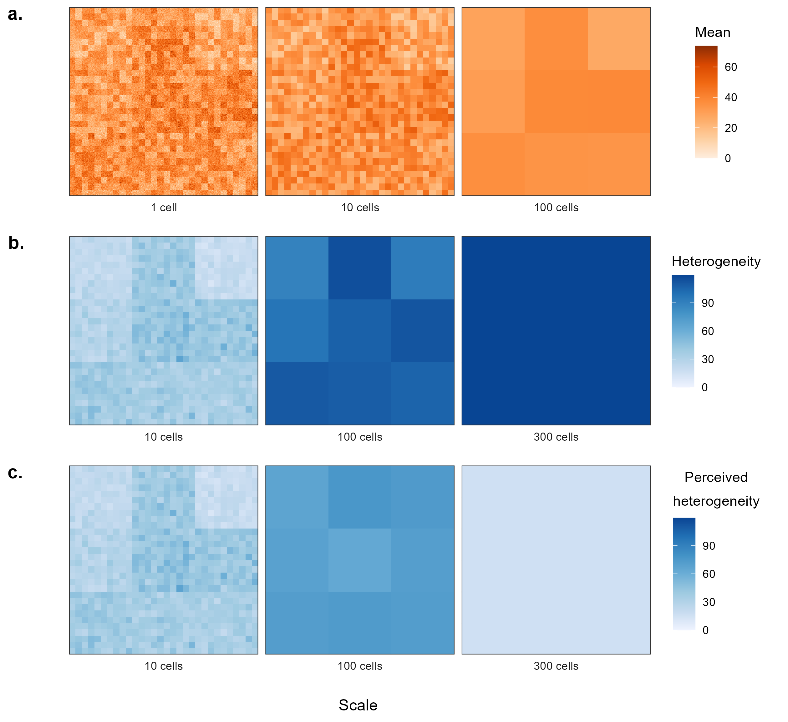

\newpage

# Chapter 2: A new measure of environmental variance {#var-raster}

Whether an animal is affected by or can perceive environmental variance depends strongly on the spatiotemporal scale of the process(es) involved. Organisms are most affected by stochastic events and processes which occur on time scales which are in the order of the organisms' life spans or generation times [@southwood_habitat_1977]. Weekly heavy rains which alter a lake's salinity are more likely to affect an individual than a multi-centennial drought, and the high salinity that follows the drought may be perceived as the (stressful) standard by individuals which were born during or following the drought. In contrast, organisms can adapt to unpredictable heavy rains if they occur on a daily frequency. However, stochastic processes and events which occur on time scales that are longer than an organism's lifespan may still cause significant effects on a population's fitness and stability. Droughts which occur on the time scale of centuries or millennia [@haig_assessment_2013] are unlikely to affect organisms directly, but such events could still alter the population's habitat or breeding grounds enough to cause a population collapse or prevent individuals from reproducing in their habitual breeding region (or reproduce altogether).

Thus, the scale at which we quantify variance should depend on the spatiotemporal scale and sensitivity of the animals being studied. Since this project focuses on medium to large animals, I will focus on processes and events which occur on the temporal scale of hours to decades and spatial scale of meters to kilometers. I will assume small-scale variances such as heterogeneity in grass density at the centimeter scale or fluctuations in temperature over the span of a few minutes have little to no (measurable) effect on the spatial needs of the animals which I will be studying. Even if such small-scale variances had an effect, such an effect would be hard to detect or quantify because: (1) the effect size would be small (so large amounts of data would be necessary for an appreciable result), and (2) the uncertainty in the tracking data limits the precision at which one is able to detect changes in movement in response to such small variation (figure \@ref(fig:heterogeneity)). Thus, it seems reasonable to quantify environmental variance at the scale of minutes to days and meters to kilometers.

```{r heterogeneity, fig.cap="(a.) Fictitious means of an arbitrary random variable (e.g., resource abundance, productivity, temperature, precipitation) in a two-dimensional space. The mean value varies within small-scale patches (left), between small-scale patches (center) and large scale-patches (right). Thus, the perceived means depend on the spatial scale at which the observer can detect differences. (b.) Environmental heterogeneity detected at different degrees of precision. Wider regions have a wider range of means, which results in higher heterogeneity. Thus, each cell in the left panel represents the heterogeneity of the 100 pixels in the cell, while the cells in the central panel indicate the heterogeneity in the 10,000 cells in each of the larger cells, and the right panel indicates the heterogeneity in all 90,000 pixels. (c.) Fictitious, scale-dependent, perceived heterogeneity. The left panel is calculated as in row (b), while heterogeneity in the central and right panels are calculated on the means in the central and right panels in row (a), respectively. Perceived heterogeneity is lower than true heterogeneity because heterogeneity is lost when averaging values.", out.width = '0.6\\textwidth', fig.align = 'right', wrapfigure = list('R', 0.6)}

```

To my knowledge, there currently is no large-scale measurement of environmental variance. Producing a worldwide raster of such a measure would allow researchers to estimate the spatiotemporal variance of an animal's habitat and better understand not only how heterogeneity and unpredictability affect its home range, but also when and why animals decide to migrate or become nomadic, and many other behaviors or decisions, such as the timing of reproduction, when animals decide to defend territory and resources, and more. Some measures of environmental productivity and heterogeneity already exist, such as the machine learning human footprint index (ml-HFI) produced by @keys_machine-learning_2021 and the Normalized Difference Vegetation Index [NDVI, @pettorelli_normalized_2011]. However, none of these indices provides a comprehensive measure of environmental variance over the years. For instance, the ml-HFI is a temporally static raster, so it prevents us from accounting for temporal changes in anthropogenic habitat alteration, and neither the ml-HFI and the NDVI account for the frequency of events. 

<!--
when was NDVI calculated globally? do we need to extrapolate for years prior to 1999? if so, we should check predictions for spatiotemporal accuracy

quantify levels and stability of green light wave (see NDVI) with and without human modification/activity. model interaction of NDVI and ml-HFI? but risk over-fitting and creating spurious correlations and models hard to interpret. -->


A measure of environmental variance should thus account for the spatiotemporal variance in frequent events (e.g., precipitation) and continuous processes (e.g., temperature) as well as the frequency of extreme and rare events (e.g., fires, cyclones). How the frequency and average intensity of events are estimated depends on the event(s) considered. Processes for which we have an abundance of global-scale data, such as daily air temperature and precipitation can be included as raw data, and their variances can be estimated using smooth location-scale models, such as GAMs with appropriate conditional distributions [i.e., Gaussian location-scale for temperature and Gamma location-scale for precipitation; see @stasinopoulos_generalized_2007; @umlauf_bamlss_2018]. In contrast, the frequency of rare events should be modeled with more smooth (i.e., less flexible) models, since the low data availability does not allow us to use models with high degrees of freedom [i.e., very wiggly predictors; see @simpson_modelling_2018].

## Quantifying environmental variance

Let $Z$ indicate the measure of environmental variance used in this thesis. $Z$ should contain information on a multitude of sources of environmental variance, including daily, seasonal, and spatial variance (e.g., changes in temperature, precipitation, and photoperiod, NDVI), inter-annual variance [e.g., climatic oscillations such as the El Niño-Souther Oscillation, see @rasmusson_meteorological_1983; and anthropogenic climate change, see @ipcc_global_2018], and the frequency of extreme events, such as fires, floods, and droughts. The variation from most sources can be modeled using a Generalized Additive Model [GAM, see @wood_fast_2011; @wood_generalized_2017] for location and scale [GAMLS, see @stasinopoulos_generalized_2007] with an appropriate distribution.^[For example, temperature (measured in $^\circ$C) could be modeled using a Gaussian distribution since it can take both positive and negative values, while precipitation is strictly positive and continuous, so a Gamma distribution would be appropriate. A beta distribution could be used to model the proportion of a day with light (e.g., hours of sunlight divided by 24, which would result in a proportion in the interval $[0, 1]$) and NDVI [@pettorelli_normalized_2011], since it can easily be transformed from the interval $[-1, 1]$ to $[0, 1]$ using the function $g(x) = (x + 1)/2$. Note that it is acceptable to transform the models' responses (light per day and NDVI) since both transformations ($f(x) = x / 24$ and $g(x) = (x + 1)/2$) are linear (i.e. only comprised of addition and multiplication), so Jensen's inequality [@jensen_sur_1906] does not apply here.] Similarly, the frequency of extreme events can be estimated from the estimated probability of occurrence of the event. We can estimate such probability using a piece-wise exponential additive model [PAM; see @bender_pammtools_2018], which is a GAM for time-to-event data.

<!-- Many sources of variation are likely correlated (e.g., temperature, precipitation, occurrence of fires), so it may not be necessary to include many sources of variation in $Z$ to obtain an appreciable estimate. However, by using flexible yet penalized models such as GAMs and PAMs, I can include many sources of variation without risking model over-fitting and inflated coefficients. -->

Since each source of variation will affect animals to different degrees and will have different units (e.g., $^\circ$C, milliliters, hours) or no units (e.g., NDVI, frequency of events), and different ranges (e.g., $(-\infty, \infty)$ for temperature, $[0, \infty)$ for precipitation, $[0, 1]$ for fraction of daylight, and $[-1, 1]$ for NDVI), it would not be appropriate to define $Z$ as the sum of each variance. Instead, a weighted average of the (scaled) variances or coefficients of variation (i.e., standard deviation over mean) may be more appropriate. Weights and scaling could be informed by an algorithm similar to a principal components analysis (PCA) that varies over time and space. However, the more abstract $Z$ is, the less interpretable it becomes, so results based on $Z$ should be interpreted carefully since a different set of variables or different weights may result in different conclusions. Therefore, although using few sources of variance will fail to account for some factors, the results may be easier to understand and apply. This would particularly be the case if few variables accounted for most environmental variance.

Since the variance of a process has a lower limit (0) but does not necessarily have an upper limit, it seems reasonable to model $Z$ using a Gamma distribution for the model residuals. Estimating $\mathbb E(Z)$ over time and space will require various measures of spatiotemporal heterogeneity and stochasticity. The measure should vary over time and space, such that: (1) $\mathbb E(Z)$ changes over time, (2) individual location can have different values of $\mathbb E(Z)$, and (3) the change in $\mathbb E(Z)$ over time can also differ between habitats, since it may change faster in some habitats than others, and the shape and direction of the change may also differ between locations. Thus, the model used to estimate environmental variance should have 3 main terms: (1) a term for the global average over time ($t$), (2) a term for the global average over space (longitude, $s_x$, and latitude, $s_y$), and (3) an interaction term of space and time that allows locations to deviate from the global average temporal and spatial trends:

\begin{equation} \label{variance-model}
\mathbb E(Z) = f_1(t) + f_2(s_1, s_2) + f_3(t, s_1, s_2)
\end{equation}

The terms should be smooth and sufficiently complex to maximize model flexibility, but the wiggliness should also be penalized to avoiding over-fitting the data [@simpson_modelling_2018]. Thus, it seems appropriate to estimate the average $Z$ over space and time using a GAM, which can be fit easily using the `mgcv` [@wood_generalized_2017] package for `R` [@r_core_team_r_2021]. The smooth of time, $f_1(t)$ could be modeled with a thin-plate spline smooth [@wood_thin_2003; @simpson_modelling_2018], while the two-dimensional spatial term, $f_2(s_1, s_2)$, should use a two-dimensional spline. While splines on the sphere [@wahba_spline_1981] would provide a good approximation for the shape of the earth, $Z$ will likely be constrained to terrestrial or freshwater habitats, so Duchon splines are a better alternative [@duchon_splines_1977]. Duchon splines are well-behaved as they move away from the support of the data, so they are less likely to produce questionable edge behavior. Finally, the interaction term $f_3(t, s_1, s_2)$ can be modeled as the tensor interaction product [@wood_straightforward_2013] of time and space, with a thin-plate spline smooth for time and a Duchon spline for space. To reduce computation time, the GAM will be fit using the `bam()` function from the `mgcv` package, which fits models similarly to `mgcv::gam()` but is specific for fitting models to very large datasets. `bam()` allows model fitting using fast restricted maximum likelihood and discretized covariates [@li_faster_2020; @wood_generalized_2017-1; @wood_generalized_2015], with no appreciable loss to model fit.

<!-- could add mention to the study that used the geometric mean as a simple option -->
